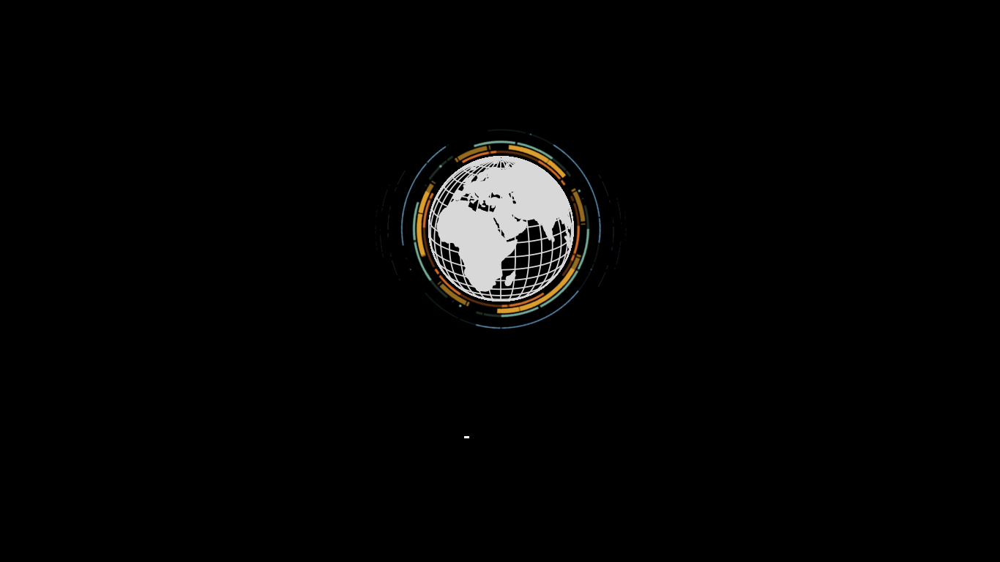

# Globe

Animated plymouth theme with rotating globe.

Modified from [vortex-ubuntu-plymouth-theme](https://github.com/emanuele-scarsella/globe-plymouth-theme)
and [hawt-rotor-plymouth-theme](https://github.com/andre-kotze/hawt-rotor-plymouth-theme)

## Dependencies

* plymouth, libplymouth5, plymouth-label
* Recommended: plymouth-x11
* Install dependencies with `sudo apt install plymouth libplymouth5 plymouth-label`

### Boot up splash screen



### Shutdown splash screen


## Installation

* go to the downloaded `globe-plymouth-theme` folder from terminal

```bash
cd /PATH/TO/globe-plymouth-theme
```

or by opening the folder with your file explorer and going to RIGHT-CLICK > Open in Terminal

* make the `install` file executable

```bash
sudo chmod +x install
```

* execute the `install` file

```bash
sudo ./install
```

## Test

* go to the downloaded `globe-plymouth-theme` folder from terminal

```bash
cd /PATH/TO/globe-plymouth-theme
```

or by opening the folder with your file explorer and going to RIGHT-CLICK > Open in Terminal

* make the `show-splash.sh` file executable

```bash
sudo chmod +x show-splash.sh
```

* execute the `show-splash.sh` file

```bash
sudo ./show-splash.sh
```

## Removal

* go to the downloaded `globe-plymouth-theme` folder from terminal

```bash
cd /PATH/TO/globe-plymouth-theme
```

or by opening the folder with your file explorer and going to RIGHT-CLICK > Open in Terminal

* make the `uninstall` file executable

```bash
sudo chmod +x uninstall
```

* execute the `uninstall` file

```bash
sudo ./uninstall
```

* then when asked chose the new plymouth theme by typing the number of your choice and pressing `Enter`

## Customizing background color

* open the file in `globe/bg.png` in any image editor of your choice

* fill the image with the color you want as background

* save changes ensuring to NOT change neither the file name `bg.png` neither his location `globe`

* proceed to installation/reinstallation

## Customizing background image

* rename, remove or move to a different folder the file in `globe/bg.png`

* put your custom background image IN PNG FORMAT inside the `globe` folder

* rename your custom beckground image as `bg.png`

* proceed to installation/reinstallation

### License

This project is licensed under the GPL v.2 License - see the LICENSE.md file for details
